<h1 align="center">dbtui</h1>

<p align="center">
  A modern terminal-based MySQL/MariaDB client built with Go and <a href="https://github.com/charmbracelet/bubbletea">Bubble Tea</a>.
</p>

<p align="center">
  
  
  
  
</p>

<p align="center">
  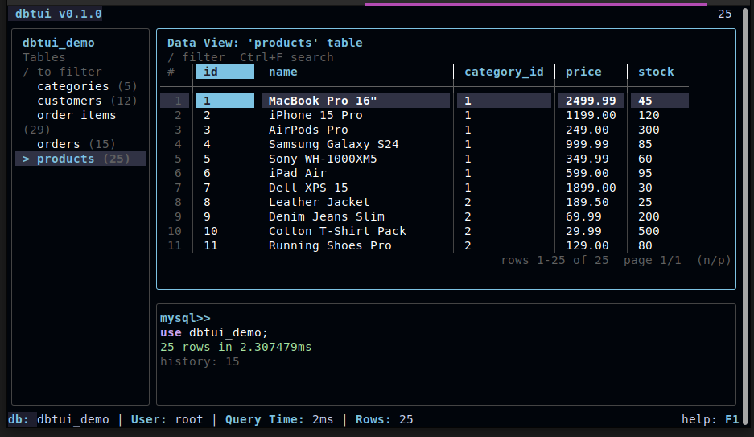
</p>

## Features

- **Split-pane TUI** — sidebar, data grid, and query editor in one view
- **Table browser** — navigate tables with keyboard, view detailed schema info
- **Server-side search** — query entire tables with column-specific filters (`Ctrl+F`)
- **Client-side filter** — instantly filter displayed rows with `/`
- **SQL autocomplete** — keyword and table name completion with `Ctrl+Space`
- **SQL syntax highlighting** — keywords, strings, and numbers colored in real-time
- **Query bookmarks** — save and load frequently used queries
- **Table favorites** — pin tables to the top of the sidebar
- **Row detail view** — inspect individual rows in a vertical layout
- **Column sorting** — sort by any column, toggle ascending/descending
- **Row numbers** — toggle row number display
- **Row deletion** — delete rows with confirmation (requires primary key)
- **Export data** — CSV (`Ctrl+S`) or JSON (`Ctrl+J`)
- **Copy to clipboard** — copy cell (`c`) or entire row (`y`)
- **Database switching** — `USE dbname;` or `Ctrl+D` without reconnecting
- **Server-side pagination** — efficiently browse large tables page by page
- **Query history** — persistent history with up/down navigation
- **Dark/Light themes** — toggle with `Ctrl+T`
- **TLS/SSL support** — connect with certificates, skip-verify, or mutual TLS
- **Connection profiles** — save named connections in config
- **Auto-reconnect** — reconnects up to 3 times on connection drop
- **Query cancellation** — `Ctrl+C` cancels a running query

## Installation

### Pre-built binaries

Download the latest release from [GitHub Releases](https://github.com/alaa/dbtui/releases). Binaries are available for Linux, macOS, and Windows.

### Linux packages

```bash
# Debian / Ubuntu
sudo dpkg -i dbtui_*.deb

# Fedora / RHEL
sudo rpm -i dbtui_*.rpm

# Alpine
sudo apk add --allow-untrusted dbtui_*.apk
```

### Go install

```bash
go install github.com/alaa/dbtui@latest
```

### Build from source

```bash
git clone https://github.com/alaa/dbtui.git
cd dbtui
go build -o dbtui .
```

## Quick Start

```bash
# Connect with flags
dbtui -u root -p secret mydb

# Connect with DSN
dbtui --dsn "root:secret@tcp(127.0.0.1:3306)/mydb"

# Use a saved connection profile
dbtui -c local
```

## Screenshots

### Table Browser & Schema Info

Browse tables in the sidebar. Press `i` on any table to view detailed schema information including columns, types, indexes, foreign keys, engine, collation, and more.

<p align="center">
  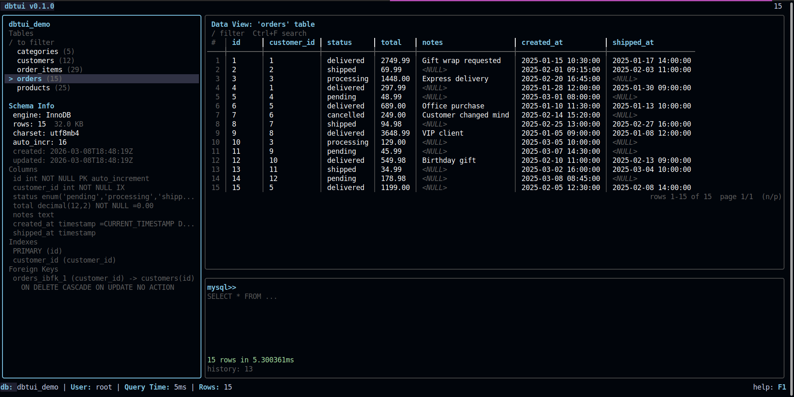
</p>

### Sidebar Filter & Favorites

Press `/` in the sidebar to filter tables by name. Press `f` to mark a table as favorite — favorites are pinned to the top and persist across sessions.

<p align="center">
  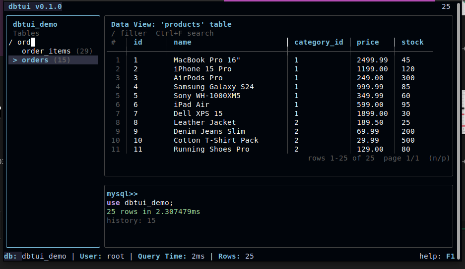
  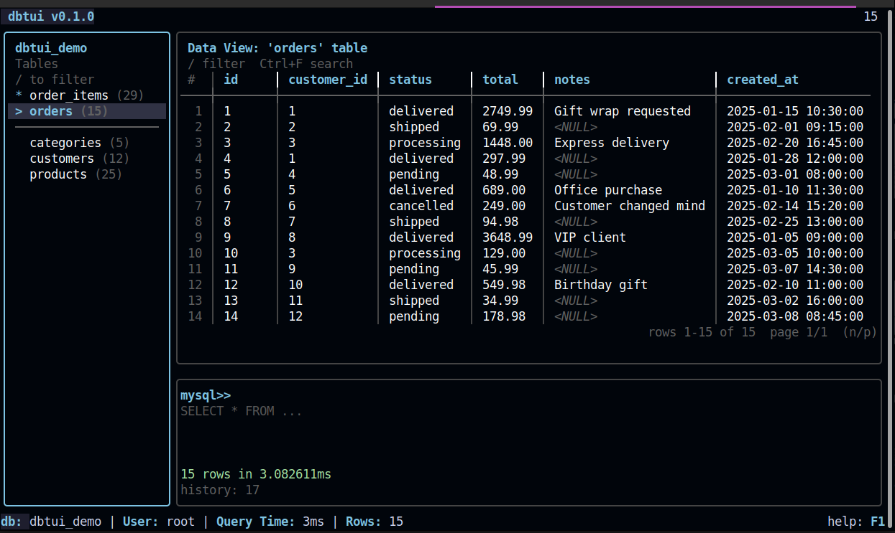
</p>

### Server-Side Search

Press `Ctrl+F` to open the search form. Select a column, choose an operator (contains, equals, starts with, ends with), and enter a value. The query runs against the entire table, not just the current page.

<p align="center">
  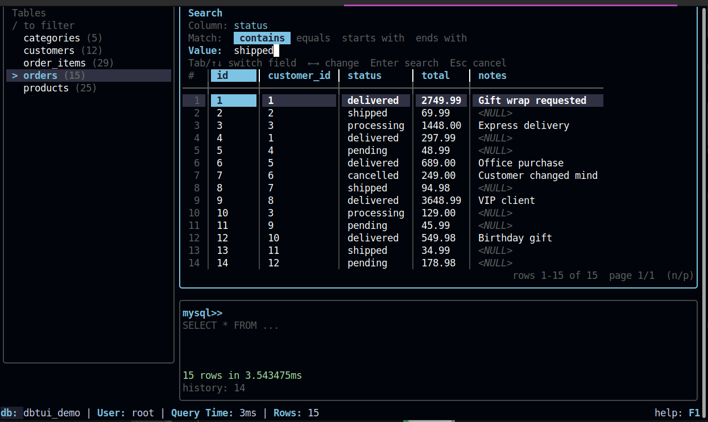
</p>

<p align="center">
  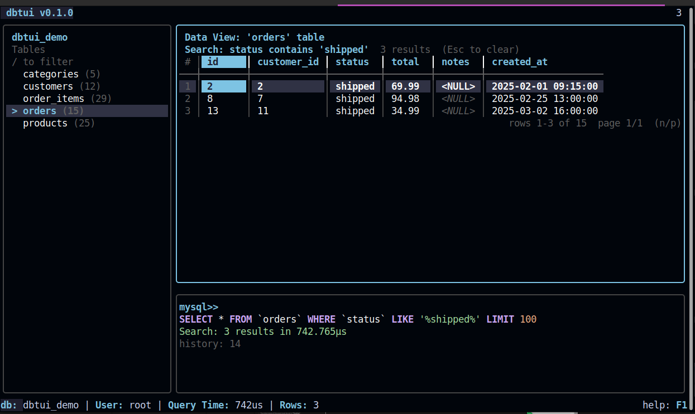
</p>

### Client-Side Filter

Press `/` in the data view for instant in-page filtering. Supports column-specific filtering with `column | value` syntax.

<p align="center">
  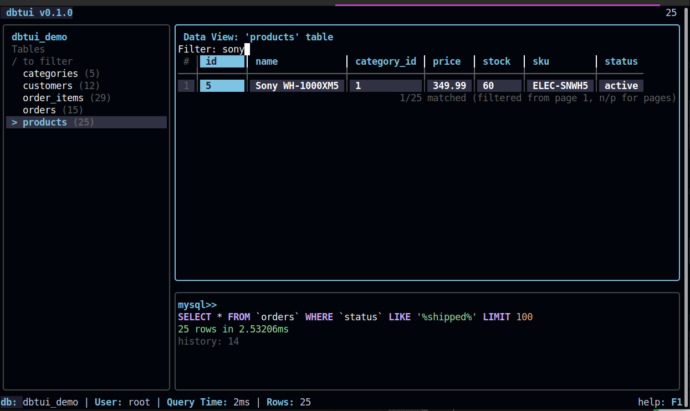
</p>

### Row Detail View

Press `d` to toggle a vertical detail view for the selected row — useful for tables with many columns.

<p align="center">
  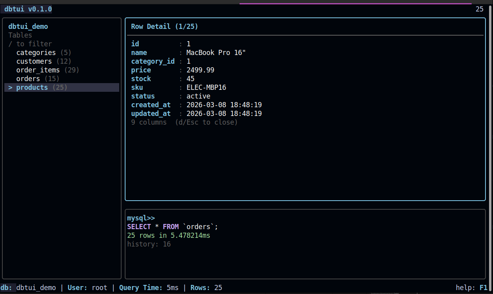
</p>

### Query Editor

Write and execute SQL queries with syntax highlighting and autocomplete. Press `Ctrl+Space` for keyword and table name suggestions. Navigate query history with up/down arrows.

<p align="center">
  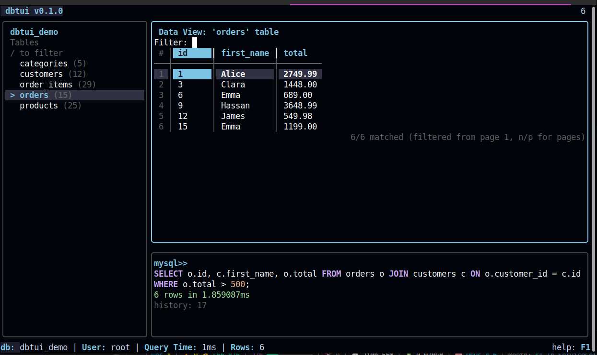
</p>

### Query Bookmarks

Save frequently used queries with `Ctrl+K` and load them later with `Ctrl+B`.

<p align="center">
  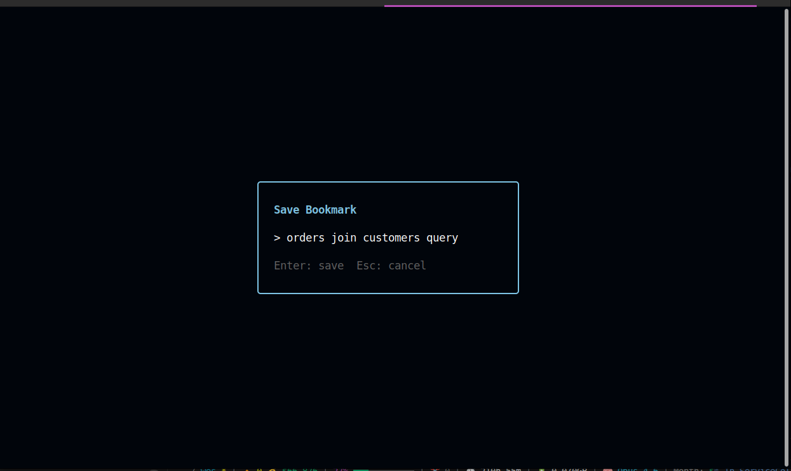
  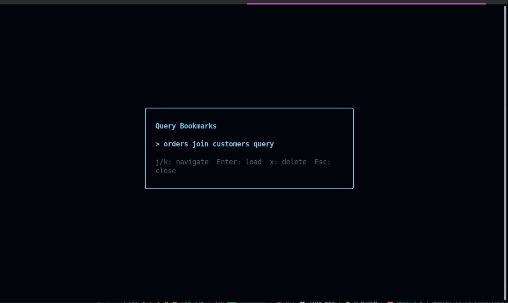
</p>

## Usage

```bash
# Connect with flags
dbtui -u root -p secret mydb

# Connect with DSN
dbtui --dsn "root:secret@tcp(127.0.0.1:3306)/mydb"

# Show version
dbtui --version
```

### Flags

| Flag        | Description                          | Default     |
|-------------|--------------------------------------|-------------|
| `-u`        | MySQL user                           | (required)  |
| `-p`        | MySQL password                       |             |
| `-h`        | MySQL host                           | `127.0.0.1` |
| `-P`        | MySQL port                           | `3306`      |
| `-c`        | Connection profile name from config  |             |
| `--dsn`     | Full DSN string (overrides others)   |             |
| `--tls`     | TLS mode: `true`, `skip-verify`, or CA cert path |  |
| `--tls-cert`| Path to client certificate (mutual TLS) |          |
| `--tls-key` | Path to client key (mutual TLS)      |             |
| `--version` | Show version                         |             |

### Connection Profiles

Save named connection profiles in your config file:

```toml
[[connections]]
name = "local"
host = "127.0.0.1"
port = 3306
user = "root"
password = "secret"
database = "mydb"

[[connections]]
name = "production"
host = "db.example.com"
port = 3306
user = "app"
password = "prod_pass"
database = "appdb"
```

```bash
dbtui -c local              # Use a saved profile
dbtui -c local -p newpass   # Override the password
dbtui -c production otherdb # Connect to a different database
```

### TLS/SSL

```bash
# System CA certificates
dbtui -u root -p pass --tls true mydb

# Skip certificate verification (self-signed)
dbtui -u root -p pass --tls skip-verify mydb

# Specific CA certificate
dbtui -u root -p pass --tls /path/to/ca.pem mydb

# Mutual TLS
dbtui -u root -p pass --tls /path/to/ca.pem \
  --tls-cert /path/to/client.pem \
  --tls-key /path/to/client-key.pem mydb
```

TLS in connection profiles:

```toml
[[connections]]
name = "secure"
host = "db.example.com"
user = "app"
password = "secret"
database = "appdb"
tls = "/path/to/ca.pem"
tls_cert = "/path/to/client.pem"
tls_key = "/path/to/client-key.pem"
```

## Keyboard Shortcuts

### Global

| Key           | Action                    |
|---------------|---------------------------|
| `Tab`         | Next pane                 |
| `Shift+Tab`   | Previous pane             |
| `Ctrl+C`      | Cancel query / Quit       |
| `Ctrl+T`      | Toggle dark/light theme   |
| `Ctrl+R`      | Refresh tables & data     |
| `Ctrl+D`      | Switch database           |
| `Ctrl+S`      | Export data as CSV        |
| `Ctrl+J`      | Export data as JSON       |
| `Ctrl+X`      | Explain current query     |
| `Ctrl+B`      | Open query bookmarks      |
| `Ctrl+K`      | Save query as bookmark    |
| `Ctrl+Left`   | Shrink sidebar            |
| `Ctrl+Right`  | Grow sidebar              |
| `F1`          | Toggle help overlay       |

### Sidebar

| Key           | Action                    |
|---------------|---------------------------|
| `j` / `k`     | Navigate tables           |
| `Enter`       | Select table, load data   |
| `i`           | Toggle schema info        |
| `g` / `G`     | Jump to first / last      |
| `/`           | Filter tables by name     |
| `f`           | Toggle favorite           |
| `Escape`      | Clear filter              |

### Data View

| Key             | Action                        |
|-----------------|-------------------------------|
| Arrows / `hjkl` | Navigate rows and columns     |
| `Ctrl+F`        | Server-side search            |
| `/`             | Client-side filter            |
| `n` / `p`       | Next / previous page          |
| `PgUp` / `PgDn` | Scroll viewport              |
| `Home` / `End`  | First / last row              |
| `d`             | Toggle row detail view        |
| `s`             | Sort by current column        |
| `c`             | Copy cell to clipboard        |
| `y`             | Copy row to clipboard         |
| `x`             | Delete row (with confirmation)|
| `Ctrl+N`        | Toggle row numbers            |
| `Escape`        | Clear filter / search         |

### Query Editor

| Key           | Action                           |
|---------------|----------------------------------|
| `Enter`       | Execute (requires `;`) or newline|
| `Ctrl+E`      | Force execute without `;`        |
| `Ctrl+Space`  | SQL autocomplete                 |
| `Up` / `Down` | Navigate query history           |
| `Escape`      | Clear input                      |

## Configuration

dbtui looks for a TOML config file in:

1. `$XDG_CONFIG_HOME/dbtui/config.toml`
2. `~/.config/dbtui/config.toml`
3. `~/.dbtui.toml`

### Example config

```toml
[display]
theme = "dark"           # "dark" or "light"
page_size = 100          # rows per page
sidebar_width = 20       # sidebar width percentage
editor_height = 8        # editor height in lines

[query]
timeout_seconds = 30     # query timeout

[history]
max_entries = 500        # max stored queries
save_to_file = true
```

## Tips

- Press `Ctrl+D` to open the database switcher, or type `USE dbname;` in the editor
- Use `column | value` in the filter for column-specific filtering
- `Ctrl+C` cancels a running query — press again to quit
- Query history is saved to `~/.config/dbtui/history`
- Exports are saved to the current directory as `dbtui_export_YYYYMMDD_HHMMSS.csv/json`
- SQL keywords are syntax-highlighted in real-time as you type

## Project Structure

```
dbtui/
├── main.go                         # Entry point
├── cmd/root.go                     # CLI flag parsing
└── internal/
    ├── config/                     # TOML config loading
    ├── database/                   # MySQL connection, queries, executor
    ├── stringutil/                 # Shared string utilities
    └── tui/                        # Bubble Tea TUI
        ├── app.go                  # Root model, layout, message routing
        ├── clipboard.go            # Clipboard integration
        ├── export.go               # CSV/JSON export
        ├── keys.go                 # Global keybindings
        ├── messages.go             # Message types
        ├── styles.go               # Lipgloss styles
        ├── theme.go                # Dark/light theme definitions
        └── components/
            ├── sidebar/            # Table list, favorites, schema info
            ├── dataview/           # Data grid, filter, search, pagination
            ├── editor/             # Query editor, autocomplete, highlighting
            ├── statusbar/          # Connection info, query stats
            └── titlebar/           # App title, row count
```

## Running Tests

```bash
export DBTUI_TEST_USER=root
export DBTUI_TEST_PASS=root
export DBTUI_TEST_DB=dbtui_test

go test ./... -v
```

## License

MIT
